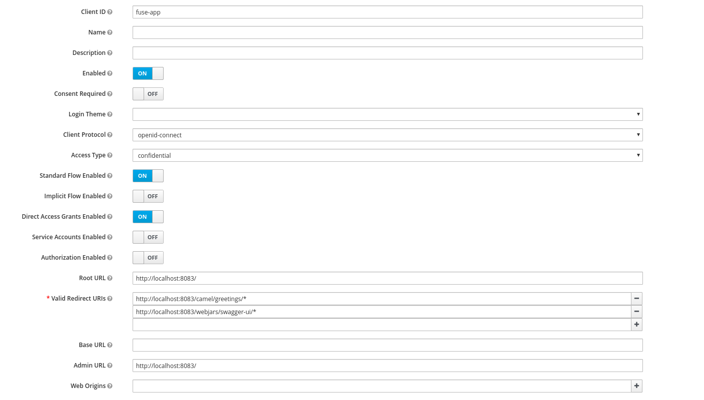

# Fuse 7.6 With Keycloak Adapter Example

## Environment
- Fuse 7.6
- Red Hat Single Sign On 7.3

## How to Configure RH-SSO

### Create a New Realm

In this example we are using the `demo-fuse` realm.

### Create a Client for the App

### Change Springboot Configuration

The application.properties have to be changed. `keycloak.credentials.secret` is generated when you create a new client. To get this value go to the client definition and click in the credentials tab.

    keycloak.realm = demo-fuse
    keycloak.auth-server-url = http://localhost:8080/auth
    keycloak.ssl-required = external
    keycloak.resource = fuse-app
    keycloak.credentials.secret = 7a0e9fbf-7ac3-4ad9-ad59-30891081b61f
    keycloak.use-resource-role-mappings = true

## How to Run Locally

    mvn clean -DskipTests spring-boot:run

## How to Deploy in OpenShift

    mvn clean -DskipTests fabric8:deploy -Popenshift
